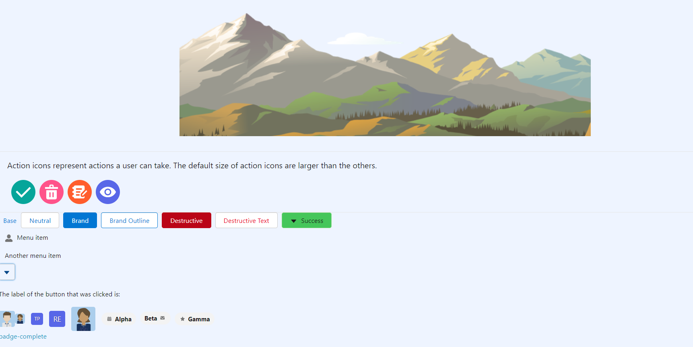

# This Repository is a Proof of concept in usin Salesforce LWC Framework with Base Components and SLDS


## Project Setup



The directory structure looks like this:

```
src/
  ├── assets/           // static assets
  │   └── recipes-logo.png
  |   └── favicon.ico
  └── modules/          // lwc modules
      └── example/
          └── app/
              ├── app.css
              ├── app.html
              └── app.js
lwr.config.json         // lwr configuration
package.json            // npm packaging configuration
```

## Configuration


```json
// Package.json
{
  "name": "lwc_base_unix",
  "version": "0.0.1",
  "license": "MIT",
  "private": true,
  
  "scripts": {
    "clean": "rm -rf node_modules __lwr_cache__ site",
    "dev": "lwr dev",
    "dev:compat": "lwr dev --mode compat",
    "build": "lwr build --clean",
    "build:prod-compat": "lwr build --clean --mode prod-compat",
    "start": "lwr start",
    "stage": "yarn build && yarn start",
    "stage:prod-compat": "yarn build:prod-compat && yarn start",
    "copyAssets": "node scripts/copyAssets.js"
  },
  "dependencies": {
    "@lwc/compiler": "1.7.7",
    "@lwc/engine": "1.7.7",
    "@lwc/rollup-plugin": "1.7.7",
    "@lwc/synthetic-shadow": "1.7.7",
    "@lwc/wire-service": "1.7.7",
    "@salesforce-ux/design-system": "^2.12.2",
    "express": "4.17.1",
    "lightning-base-components": "1.8.1-alpha",
    "lwc": "2.38.1",
    "lwr": "0.9.4",
    "rollup": "2.21.0",
    "rollup-plugin-replace": "2.2.0"
  },
  "engines": {
    "node": ">=16.0.0"
  },
  "volta": {
    "node": "18.16.1"
  },
    "devDependencies": {
    "fs-extra": "^11.1.1"
  }
}
```

## install dependency packages

```bash
$ npm install
```
## copy all slds assets to public/assets

```bash
$ copyAssets
```
## compile all dependiency packages to public/app.js file using rollup.config.js file

```bash
$ rollup --config rollup.config.js
```

## start express server using src/server.js


```bash
$ node ./src/server.js
```

Open the site at [http://localhost:3000](http://localhost:3000)

## Welcome to the LWC single page app using LWC and SLDS


